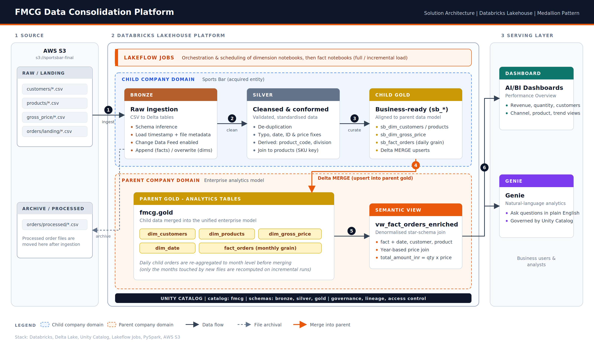

# FMCG Data Consolidation Pipeline on Databricks

An end-to-end data engineering project built on **Databricks** that consolidates a newly acquired child company's data (a sports-nutrition brand, "Sports Bar") into a parent company's analytics platform, using the **Medallion Architecture (Bronze → Silver → Gold)**, **Delta Lake**, **Unity Catalog**, and **Lakeflow Jobs**, and serves the result through an **AI/BI Dashboard** and **Genie**.

---

## Table of Contents
1. [Business Problem](#business-problem)
2. [Architecture](#architecture)
3. [Tech Stack](#tech-stack)
4. [Data Model](#data-model)
5. [Pipeline Walkthrough](#pipeline-walkthrough)
6. [Data Quality Issues Handled](#data-quality-issues-handled)
7. [Full Load vs Incremental Load](#full-load-vs-incremental-load)
8. [Serving Layer & Dashboard](#serving-layer--dashboard)
9. [Repository Structure](#repository-structure)
10. [How to Run](#how-to-run)
11. [Key Learnings](#key-learnings)
12. [Known Limitations & Future Improvements](#known-limitations--future-improvements)

---

## Business Problem

A parent company in the sports and fitness equipment space acquired a smaller child company (Sports Bar) that sells nutrition products such as energy bars, protein bars, granola and electrolyte mixes. The parent already had a clean, monthly-grain analytics model in Databricks. The child company's data, however, arrived as raw CSV files in S3 with:

- Inconsistent date formats and typos in names and cities
- Missing and invalid IDs
- Daily-grain orders, while the parent reports at monthly grain
- A different schema and different naming conventions

**Goal:** build a reliable, repeatable pipeline that cleans the child company's data, conforms it to the parent's data model, merges it into the parent's gold tables, and exposes a single unified view for BI reporting. The pipeline must also handle new order files arriving over time without reprocessing history.

---

## Architecture



**Flow:**

1. **Raw data (S3)**: the child company drops CSV files into S3 (`customers`, `products`, `gross_price`, and `orders/landing`).
2. **Lakeflow Jobs** orchestrates the notebooks.
3. **Bronze**: raw ingestion into Delta tables with file metadata.
4. **Silver**: cleaning, standardisation, and de-duplication.
5. **Child Gold**: business-ready tables prefixed `sb_` (Sports Bar).
6. **Merge with parent gold**: child gold data is merged into the parent's gold tables (`dim_customers`, `dim_products`, `dim_gross_price`, `fact_orders`) using Delta `MERGE`.
7. **Archive**: processed order files are moved from `landing/` to `processed/` in S3.
8. **Serving layer**: a denormalised view feeds the Databricks Dashboard and Genie.


---

## Tech Stack

| Area | Technology |
|---|---|
| Platform | Databricks |
| Storage | AWS S3 (raw, landing, processed/archive) |
| Processing | PySpark, Spark SQL |
| Table format | Delta Lake (Change Data Feed enabled) |
| Governance | Unity Catalog (`fmcg` catalog: `bronze`, `silver`, `gold` schemas) |
| Orchestration | Lakeflow Jobs |
| Serving | Databricks AI/BI Dashboards, Genie |


---

## Data Model

### Parent gold (target) tables

| Table | Grain | Key columns |
|---|---|---|
| `fmcg.gold.dim_customers` | one row per customer | `customer_code`, `customer`, `market`, `platform`, `channel` |
| `fmcg.gold.dim_products` | one row per product | `product_code`, `division`, `category`, `product`, `variant` |
| `fmcg.gold.dim_gross_price` | one row per product per year | `product_code`, `price_inr`, `year` |
| `fmcg.gold.dim_date` | one row per month | `date_key`, `month_start_date`, `year`, `month_name`, `quarter`, ... |
| `fmcg.gold.fact_orders` | **monthly** product × customer | `date` (month start), `product_code`, `customer_code`, `sold_quantity` |

### Child (Sports Bar) gold tables

`sb_dim_customers`, `sb_dim_products`, `sb_dim_gross_price`, `sb_fact_orders` (daily grain).

### Serving view

`fmcg.gold.vw_fact_orders_enriched` joins the fact table to all dimensions and derives the revenue metric:

```sql
total_amount_inr = sold_quantity * price_inr
```

The price join is year-based (`YEAR(fo.date) = gp.year`), so each order picks up the price for its year. See [`sql/denormalise_table_query_fmcg.sql`](sql/denormalise_table_query_fmcg.sql).

---

## Pipeline Walkthrough

Every notebook starts the same way: it runs a shared `utilities` notebook (which defines `bronze_schema`, `silver_schema`, `gold_schema`) and exposes `catalog` and `data_source` as Databricks widgets, so the same code pattern is reused across all entities.

### 1. Customers: `1_customers_data_processing`

| Layer | What happens |
|---|---|
| **Bronze** | Read CSVs from `s3://sportsbar-final/customers/`, add `read_timestamp`, `file_name`, `file_size`, write Delta (overwrite) |
| **Silver** | Drop duplicate `customer_id`s, trim whitespace in names, fix city typos (e.g. `Bengaluruu`, `Bengalore` → `Bengaluru`; `NewDheli` → `New Delhi`), restrict city to an allowed list, Title-Case names, fill missing cities using a **business-confirmed mapping** for four customers, cast `customer_id` to string |
| **Conform to parent model** | Build `customer = "<name>-<city>"` (or `-Unknown`), and add static attributes `market = India`, `platform = Sports Bar`, `channel = Acquisition` |
| **Gold** | Select required columns into `sb_dim_customers` |
| **Merge** | `MERGE` into `fmcg.gold.dim_customers` on `customer_code` (update if matched, insert if new) |

### 2. Products: `2_products_data_processing`

| Layer | What happens |
|---|---|
| **Bronze** | Raw CSV ingestion with file metadata |
| **Silver** | Drop duplicate `product_id`s, Title-Case `category`, fix the `Protien` → `Protein` spelling in both `product_name` and `category`, derive **`division`** from category (e.g. Energy Bars / Protein Bars → Nutrition Bars), extract **`variant`** from the parenthesised text in the product name, generate a deterministic **`product_code = sha2(product_name, 256)`**, replace non-numeric `product_id`s with `999999` |
| **Gold** | `sb_dim_products` |
| **Merge** | `MERGE` into `fmcg.gold.dim_products` on `product_code` |

### 3. Pricing: `3_pricing_data_processing`

| Layer | What happens |
|---|---|
| **Bronze** | Raw CSV ingestion |
| **Silver** | Parse `month` from four possible date formats using `try_to_date` + `coalesce`; validate `gross_price` with a regex, convert negatives to positives, and set non-numeric values to `0`; inner-join to `silver.products` to attach `product_code` |
| **Gold** | `sb_dim_gross_price` |
| **Merge** | Reduce to **one price per product per year**: a window function ranks rows by "non-zero first, then latest month" and keeps rank 1. The result is merged into `fmcg.gold.dim_gross_price` as `price_inr` |

### 4. Orders (fact): two notebooks

See [Full Load vs Incremental Load](#full-load-vs-incremental-load) below.

---

## Data Quality Issues Handled

| Entity | Issue | Fix |
|---|---|---|
| Customers | Duplicate IDs | `dropDuplicates(['customer_id'])` |
| Customers | Leading/trailing spaces, inconsistent casing | `trim`, `initcap` |
| Customers | City typos | Mapping dictionary + allowed-values whitelist |
| Customers | Null cities | Business-confirmed lookup, left-joined and `coalesce`d |
| Products | Duplicates, casing, `Protien` typo | `dropDuplicates`, `initcap`, `regexp_replace` |
| Products | Invalid `product_id` | Fallback value `999999` so fact rows are not lost |
| Pricing | 4 different date formats | `coalesce` of multiple `try_to_date` calls |
| Pricing | Negative / non-numeric prices | `abs()` for negatives, `0` for non-numeric |
| Pricing | Multiple prices per year | Window function picks latest non-zero price |
| Orders | Null `order_qty` | Rows filtered out |
| Orders | Invalid `customer_id` | Fallback value `999999` |
| Orders | Dates like `Tuesday, July 01, 2025` | Strip weekday with regex, then multi-format parse |
| Orders | Duplicate rows | `dropDuplicates` on order_id, date, customer, product, qty |

---

## Full Load vs Incremental Load

The orders data is the largest and fastest-changing source, so it has two notebooks.

### `1_full_load_fact` (historical backfill)
- Reads every CSV in `orders/landing/`, **appends** to Bronze, then moves files to `orders/processed/`.
- Cleans and joins to `silver.products`, then upserts into Silver and `sb_fact_orders` (daily grain) using `MERGE`.
- Aggregates the **entire** daily table to monthly grain (`trunc(date, 'MM')`, `sum(sold_quantity)`) and merges into the parent's `fact_orders`.

### `2_incremental_load_fact` (ongoing loads)
- Appends new files to Bronze **and** writes them to a `staging_orders` table, so only newly arrived data is processed downstream.
- Silver and Gold are updated via `MERGE` using only the staging data.
- **Key design point:** to refresh the parent's monthly fact, it finds which months are touched by the new data, **recomputes those months in full from the child daily table**, and merges the results. This avoids double counting and correctly handles late-arriving orders for a month already loaded.
- Staging tables are dropped at the end (cleanup).

Both notebooks are idempotent: re-running them does not duplicate rows, thanks to `MERGE` keys on date, order, product and customer.

---

## Serving Layer & Dashboard

The `fmcg_dashboard` ("Performance Overview") is built on `vw_fact_orders_enriched` with filters for Year, Quarter, Month, Channel and Category.

**Headline KPIs**

| Metric | Value |
|---|---|
| Total Revenue | 105.34B |
| Total Quantity Sold | 34.13M |
| Unique Customers | 54 |
| Average Selling Price | 4,043.16 |

**Visuals**
- Top products by revenue
- Revenue share by channel (Retailer ~78.5%, Direct ~20.2%, Acquisition = the integrated child company)
- Monthly revenue trend (clear spike in Sep–Nov, peaking in November at ~20.8B)
- All customers by revenue (table)
- Top variants by revenue
- Product price vs quantity (bubble/scatter)

The full export is in [`dashboard/fmcg_dashboard.pdf`](dashboard.pdf). **Genie** is also enabled on the same data so business users can ask questions in natural language.

---

## Repository Structure

```
.
├── README.md
├── architecture/
│   ├── architecture_diagram.svg
│   ├── architecture_diagram.png
│   └── databricks_project.excalidraw
├── notebooks/
│   ├── 1_dimension_processing/
│   │   ├── 1_customers_data_processing.ipynb
│   │   ├── 2_products_data_processing.ipynb
│   │   └── 3_pricing_data_processing.ipynb
│   └── 2_fact_processing/
│       ├── 1_full_load_fact.ipynb
│       └── 2_incremental_load_fact.ipynb
├── sql/
│   └── denormalise_table_query_fmcg.sql
└── dashboard/
    └── fmcg_dashboard.pdf
```

> The notebooks reference `/Workspace/consolidated_pipeline/1_setup/utilities`, which defines the schema names. Add that notebook to the repo too if you want the project to be reproducible.

---

## How to Run

1. **Set up Unity Catalog:** create catalog `fmcg` with schemas `bronze`, `silver`, `gold`, and create the parent gold tables (`dim_customers`, `dim_products`, `dim_gross_price`, `dim_date`, `fact_orders`).
2. **Configure storage:** create an S3 bucket with folders `customers/`, `products/`, `gross_price/`, and `orders/landing/` + `orders/processed/`, and grant Databricks access through an external location.
3. **Import notebooks** into the workspace under `consolidated_pipeline/` and run the `utilities` notebook setup.
4. **Run dimensions in order:** customers → products → pricing (pricing depends on `silver.products`).
5. **Run the fact load:** `1_full_load_fact` once for history, then `2_incremental_load_fact` whenever new order files land.
6. **Create the view** by running `sql/denormalise_table_query_fmcg.sql`.
7. **Build the dashboard** on top of `fmcg.gold.vw_fact_orders_enriched`.
8. **Automate** with a Lakeflow Job that chains the notebooks (dimensions first, then fact) on a schedule or file-arrival trigger.

---

## Key Learnings

- Designing a **Medallion pipeline** that separates raw ingestion, cleaning and business-ready data
- Using **Delta `MERGE`** for idempotent upserts across all layers
- **Conforming** an acquired company's data to an existing enterprise data model (surrogate keys, naming, static attributes)
- Resolving a **grain mismatch** (daily child data vs monthly parent facts) with correct re-aggregation
- Building **incremental pipelines** with staging tables and affected-partition recomputation
- Defensive data cleaning with **fallback values** so fact records are never silently dropped
- Governance with **Unity Catalog** and self-service analytics with **Dashboards + Genie**

---

## Known Limitations & Future Improvements

- Orders with an invalid `customer_id` get `999999`, which has no matching row in `dim_customers`; add an explicit "Unknown" dimension member so these rows are labelled rather than showing nulls in the view.
- The `dim_gross_price` merge matches on `product_code` only; matching on `product_code` **and** `year` would be safer when several years of prices exist.
- Silver and Gold dimension tables use `overwrite`; for larger volumes, switch to incremental merge or Auto Loader.
- Add automated data-quality checks (e.g. Lakeflow expectations or Great Expectations) and row-count reconciliation between layers.
- Replace hard-coded city fixes with a maintained reference table.
- Use Auto Loader / file-arrival triggers instead of manual or scheduled runs.
- Add CI/CD (Databricks Asset Bundles) for deployment.
